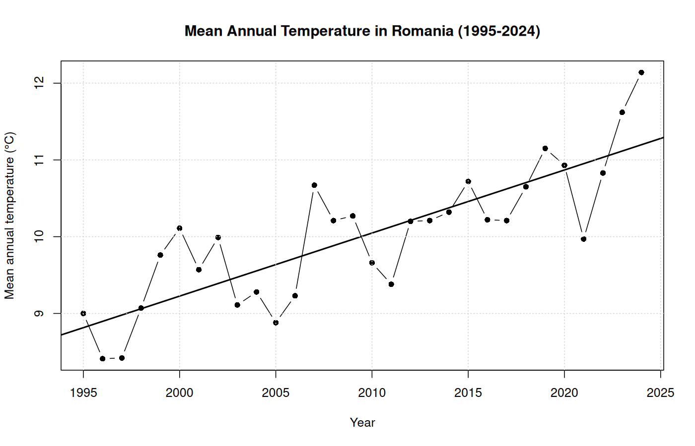
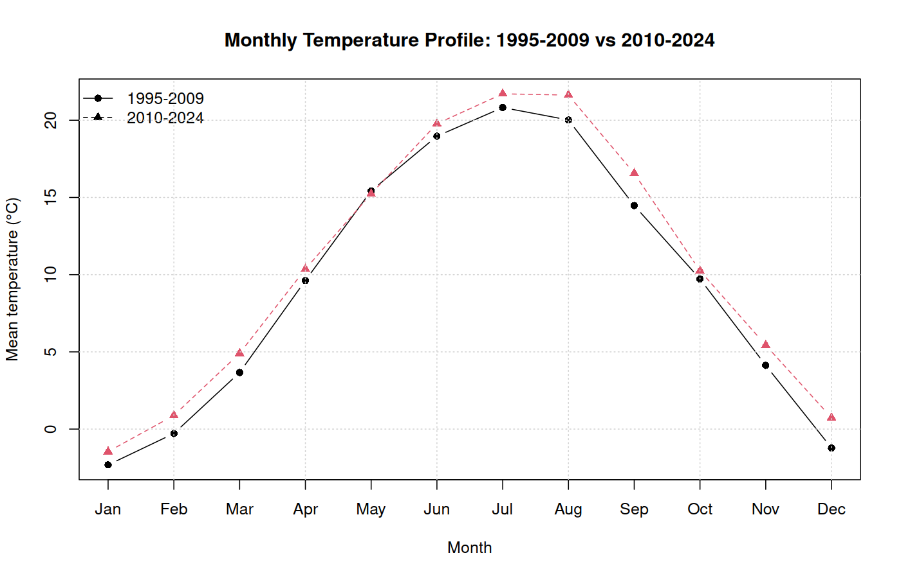
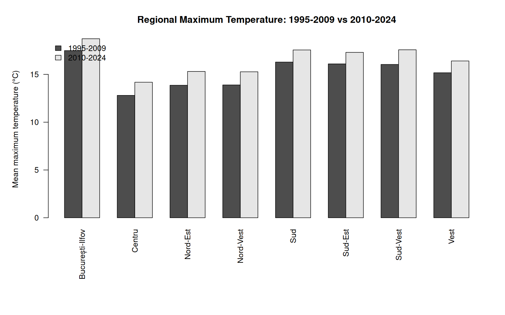

# Statistical Analysis of Climate Variability in Romania

## Overview

This project was developed as my Bachelor's dissertation in **Statistics and Economic Forecasting** at the Bucharest University of Economic Studies.

The study examines climate variability across Romania over the **1995–2024** period, with three main analytical perspectives:

- long-term changes in national mean temperature;
- regional differences in maximum temperature and daily precipitation;
- changes in the seasonal profile of mean temperature.

The analysis combines **R**, **Microsoft Excel** and **ArcGIS Pro**. R was used for statistical modelling and hypothesis testing, Excel for data organisation, aggregation, comparative analysis and visualisation, while ArcGIS Pro supported the spatial preprocessing and organisation of data by Romanian regions.

## Research Objectives

The project addresses three main questions:

1. **Is there a statistically significant upward trend in Romania's annual mean temperature between 1995 and 2024?**
2. **Do Romania's eight development regions differ significantly in maximum temperature and precipitation patterns?**
3. **Has the monthly temperature profile changed between 1995–2009 and 2010–2024?**

## Data

**Source:** E-OBS climate dataset, accessed through the Copernicus Climate Data Store  
**Period:** 1995–2024  
**Temporal resolution:** Daily observations, subsequently aggregated for the analysis  
**Geographical scope:** Romania, including the eight development regions

The broader dataset included indicators such as:

- mean temperature;
- maximum temperature;
- minimum temperature;
- precipitation;
- wind speed.

The main statistical analysis focused on **annual mean temperature, regional maximum temperature, regional daily precipitation and monthly mean temperature**.

### Data preparation workflow

`E-OBS climate data → spatial preprocessing in ArcGIS Pro → aggregation and organisation in Excel → statistical analysis in R and Excel`

The data were checked, cleaned and aggregated at national, regional and monthly levels before modelling.

## Tools and Technologies

- **R** – statistical modelling, hypothesis testing and diagnostic analysis
- **Microsoft Excel** – data preparation, aggregation, comparative tables, charts and paired-sample analysis
- **ArcGIS Pro** – spatial preprocessing and organisation of climate data by geographical area

### R packages

- `readxl`
- `Kendall`
- `tseries`
- `lmtest`
- `sandwich`

## Statistical Methods

### 1. National temperature trend

A simple **Ordinary Least Squares (OLS) regression** was estimated using annual mean temperature as the dependent variable and year as the explanatory variable.

Model diagnostics included:

- Jarque–Bera test for residual normality;
- Breusch–Pagan test for heteroscedasticity;
- Durbin–Watson test for residual autocorrelation.

Because the Durbin–Watson test indicated positive autocorrelation, the OLS inference was additionally evaluated using **Newey–West heteroskedasticity and autocorrelation-consistent standard errors**.

The trend was also independently assessed using the **Mann–Kendall non-parametric trend test**.

Finally, a **Welch two-sample t-test** compared annual mean temperatures between:

- 1995–2009;
- 2010–2024.

### 2. Regional climate differences

Regional maximum temperatures and daily precipitation were compared across Romania's eight development regions.

The **Kruskal–Wallis test** was used to determine whether the regional distributions differed significantly.

### 3. Seasonal temperature changes

Monthly mean temperature profiles were calculated separately for 1995–2009 and 2010–2024.

A **paired-samples t-test** was applied to the twelve corresponding monthly averages to test whether the overall annual temperature profile shifted between the two periods. This analysis was originally performed in Microsoft Excel for the dissertation and was reproduced in R for the GitHub version of the project.

## Visual Results

### Mean Annual Temperature in Romania (1995–2024)

  

This figure shows the long-term warming trend in Romania between 1995 and 2024.

### Monthly Temperature Profile: 1995–2009 vs 2010–2024

  

This figure highlights the upward shift in monthly temperatures in the more recent period.

### Regional Maximum Temperature Comparison

  

This chart compares regional maximum temperatures across Romania's eight development regions.

## Key Results

### Long-term warming trend

The OLS model estimated an annual temperature increase of approximately:

**+0.082°C per year**, equivalent to approximately **+0.82°C per decade**.

The model explained around **66.9% of the variation** in annual mean temperature (`R² = 0.6693`), and the time coefficient was highly statistically significant.

Residual diagnostics indicated acceptable normality and no evidence of heteroscedasticity. Positive residual autocorrelation was detected, so Newey–West robust standard errors were applied. The year coefficient remained statistically significant after this correction (`p = 0.0004717`). Positive residual autocorrelation was detected, so Newey–West robust standard errors were applied. The year coefficient remained statistically significant after this correction.

The **Mann–Kendall test** independently confirmed a strong increasing trend (`Kendall's Tau = 0.646`, `p < 0.001`).

### Difference between the two 15-year periods

Average annual mean temperature increased from:

- **9.465°C** in 1995–2009
- to **10.547°C** in 2010–2024.

This represents an increase of approximately **+1.082°C**.

The Welch test confirmed that the difference was statistically significant (`p = 0.0002414`).

### Regional differences

Average maximum temperatures increased in **all eight Romanian development regions**.

The increases ranged from approximately:

**+1.20°C to +1.53°C**

with the largest increase observed in the **South-West region (+1.53°C)**.

The Kruskal–Wallis tests confirmed statistically significant regional differences for both:

- maximum temperature (`χ² = 155.35`, `df = 7`, `p < 2.2e-16`);
- daily precipitation (`χ² = 38.801`, `df = 7`, `p = 2.133e-06`).

Unlike temperature, precipitation did not change uniformly: some regions recorded increases while others recorded decreases.

### Seasonal changes

The monthly temperature profile for 2010–2024 was higher in **11 of the 12 months** compared with 1995–2009.

The largest increases were observed in:

- **September: +2.08°C**
- **December: +1.96°C**
- **August: +1.61°C**
- **November: +1.31°C**

May was the only month with a slight decrease (**−0.19°C**).

Across the twelve months, the average difference between the two temperature profiles was approximately **+1.084°C**. The paired-samples t-test confirmed that the shift was statistically significant (`t = 5.984`, `df = 11`, `p = 9.139e-05`).

These findings indicate both a general warming of the annual temperature profile and particularly pronounced changes toward the end of summer, the beginning of autumn and the cold season.

## Main Conclusions

The results provide statistical evidence of a clear warming pattern in Romania during 1995–2024.

The analysis showed that:

- annual mean temperature followed a significant upward trend;
- the recent 2010–2024 period was significantly warmer than 1995–2009;
- maximum temperatures increased across all eight development regions;
- temperature and precipitation patterns differed significantly between regions;
- the seasonal temperature profile shifted upward, with especially large changes in late summer, autumn and winter.

Using several complementary statistical methods helped assess the robustness of these findings rather than relying on a single model.

## Limitations

The analysis uses climate data aggregated at county, regional and national levels, which may hide more localised climate patterns.

The division of the 30-year period into two equal 15-year intervals is useful for comparison but represents a methodological choice.

Positive residual autocorrelation was identified by the Durbin–Watson test (`DW = 1.2652`, `p = 0.01016`). This was addressed using Newey–West robust standard errors and by complementing the linear model with the Mann–Kendall trend test.

Precipitation was analysed using aggregated mean daily values; therefore, the project does not directly model extreme rainfall events or drought episodes.

## Skills Demonstrated

`Data Cleaning` · `Statistical Modelling` · `OLS Regression` · `Model Diagnostics` · `Robust Standard Errors` · `Hypothesis Testing` · `Non-parametric Testing` · `Regional Analysis` · `Data Visualisation` · `R` · `Excel` · `ArcGIS Pro`

## Academic Context

**Bachelor's Dissertation – Statistics and Economic Forecasting**  
Faculty of Cybernetics, Statistics and Economic Informatics  
Bucharest University of Economic Studies  
2026
